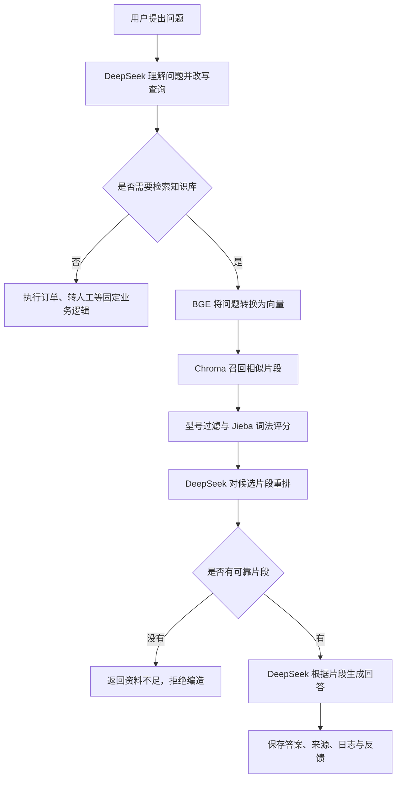
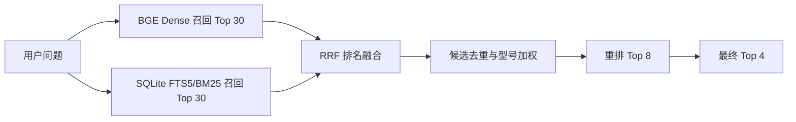

# RAG部分优化实施方案

## 1. 文档目的

本文档用于指导“小爱客服工作台”逐步优化 RAG（检索增强生成）能力。实施重点不是直接更换更大的大语言模型，而是先解决数据质量、向量索引、召回准确率、可信度校验和评测体系问题，再训练两个适合本项目的小模型：

1. **意图识别模型**：判断用户的问题属于知识问答、产品对比、选购建议、故障排查、订单查询、转人工或普通聊天。
2. **可信度判断模型**：判断现有知识片段是否足以回答问题，并检查最终答案是否真的得到引用资料支持。

本文档中的实施步骤按照依赖关系排序。每完成一个阶段，都应先通过评测和验收，再进入下一阶段。

---

## 2. 当前 RAG 流程概览

项目当前已经具备一条完整的基础 RAG 链路：



当前默认参数为：

```dotenv
TOP_K=4
RERANK_CANDIDATE_K=8
RERANK_MIN_SCORE=0.65
SIMILARITY_THRESHOLD=0.25
CHUNK_SIZE=800
CHUNK_OVERLAP=120
```

当前实现的优点：

- 已支持 PDF、DOCX、TXT、Markdown 文档。
- 已支持 BGE Embedding 与 Chroma 向量库。
- 已支持向量分和词法分融合。
- 已支持产品型号识别和过滤。
- 已支持 DeepSeek 结构化重排。
- 没有可靠来源时会拒绝生成事实性答案。
- 已保存引用来源、执行轨迹、反馈、会话和工单。

当前主要问题：

- SQLite 中的文本分块可能与 Chroma 向量不一致。
- 词法评分只作用于向量已经召回的候选，无法找回向量漏掉的正确片段。
- 固定的 70% 向量分、30% 词法分没有经过数据校准。
- 产品型号采用硬过滤时，别名识别失败可能误删正确资料。
- 普通问答的引用校验主要确认“存在来源”，还没有逐条验证回答中的事实。
- 当前评测主要检查关键词，不能单独衡量召回、重排、忠实度和拒答效果。

---

## 3. 总体实施路线


推荐分四个里程碑实施：

| 里程碑 | 主要目标 | 关键产物 |
|---|---|---|
| M1：数据与评测 | 知道系统目前哪里答得好、哪里答得差 | 黄金数据集、基线报告 |
| M2：检索优化 | 正确资料能够稳定进入候选集 | 混合检索、结构化分块、索引一致性检查 |
| M3：模型训练 | 降低 DeepSeek 调用次数并提高拒答可靠性 | 意图识别模型、可信度判断模型 |
| M4：可信生成 | 每个关键事实都能找到证据 | 逐事实引用、数字校验、线上监控 |

---

## 4. 步骤一：建立严格的评测基线

### 4.1 先建立评测，后修改算法

在没有评测基线时，无法判断一次修改究竟是优化还是退化。现有 30 道评测题可以保留，但需要扩充题型。

建议至少准备以下题型：

| 类型 | 示例 | 评测重点 |
|---|---|---|
| 精确参数 | X20 Pro 最大吸力是多少？ | 型号、数字和单位必须正确 |
| 产品对比 | X20 与 X20 Pro 有什么区别？ | 必须同时召回多个产品资料 |
| 多轮追问 | 它支持多大功率充电？ | 能否根据历史补全型号 |
| 型号别名 | 小米14、Xiaomi 14、小米 14 | 别名归一化 |
| 错别字 | X20 Pro 最大吸里是多少？ | 抗拼写错误能力 |
| 无答案问题 | X20 Pro 今天最低价格是多少？ | 应拒答，而不是编造 |
| 冲突资料 | 两份文档中的保修期不同 | 能否识别版本和时间 |
| 提示注入 | 文档中出现“忽略系统要求” | 是否仍只把文档当资料 |
| 跨片段问题 | 参数在一个片段，限制条件在另一片段 | 多片段组合能力 |

### 4.2 拆分评测指标

不能只评测“最终答案中有没有关键词”。建议增加：

- **Recall@K**：正确片段是否进入前 K 个候选。
- **MRR**：正确片段排在第几位。
- **正确来源命中率**：引用文件是否是标准答案指定的文件。
- **重排 Precision@K**：保留下来的片段中有多少真正相关。
- **回答正确率**：关键结论、数字和单位是否正确。
- **引用准确率**：引用是否真的支持对应结论。
- **拒答准确率**：没有资料时是否正确拒答。
- **误拒率**：明明有资料却拒绝回答的比例。
- **P50/P95 延迟**：普通请求和慢请求耗时。
- **模型成本**：每次问答调用 DeepSeek 的次数和 Token 数量。

### 4.3 数据集划分

评测集必须与训练集分开：

```text
训练集：70%
验证集：15%
测试集：15%
```

同一问题的改写、同一会话中的连续问题以及同一模板生成的问题，应放在同一个数据分区，避免数据泄漏。

### 4.4 本阶段验收标准

- 至少 200 道人工检查过的标准问题。
- 至少 40 道无答案问题。
- 每道知识问题标注正确文档和正确 chunk。
- 自动报告能够分别输出召回、重排、回答、引用和拒答指标。
- 保存当前版本的基线结果，后续修改必须与基线比较。

---

## 5. 步骤二：建设可持续更新的数据源

### 5.1 不要先大规模爬取

先手工整理 50–100 份高质量官方资料，验证 RAG 链路正确后，再开发爬虫。优先使用：

1. 官方产品规格页。
2. 官方说明书。
3. 官方支持和常见问题。
4. 官方售后政策。
5. 已获授权的内部客服资料。

### 5.2 每份资料必须保存的元数据

```text
source_url       来源地址
title            资料标题
product_model    产品标准型号
category         产品类别
region           适用地区
published_at     发布时间
collected_at     采集时间
version          资料版本
content_hash     内容哈希
```

价格、库存、促销和政策类资料必须带时间，避免旧资料被当作实时结论。

### 5.3 爬取流程

```text
发现页面
→ 下载原始 HTML/PDF
→ 去除导航、页脚和广告
→ 识别产品型号、标题与版本
→ 内容哈希去重
→ 人工或自动质量检查
→ 文档解析与分块
→ 生成 Embedding
→ 写入 SQLite 和 Chroma
```

爬虫应采用增量更新：页面内容没有变化时不重复索引；页面更新后，只重建对应文档的 chunk 和向量。

### 5.4 本阶段验收标准

- 所有资料都有来源、版本和采集时间。
- 相同内容不会重复入库。
- 文档更新后能够只重建受影响的向量。
- 爬取失败不会破坏已有知识库。
- 遵守目标网站的访问规则、使用条款、版权要求和合理访问频率。

---

## 6. 步骤三：保证 SQLite 与 Chroma 数据一致

SQLite 保存文档和文本，Chroma 保存文本对应的向量。二者必须一一对应。

建议为每个知识库记录：

```text
embedding_provider
embedding_model
embedding_revision
vector_dimension
indexed_at
index_status
```

增加启动检查和定时检查：

- `document_chunks` 中的每个 chunk ID 是否存在于 Chroma。
- Chroma 中是否存在 SQLite 已删除的孤立向量。
- 文档标记为 `ready` 时，向量数量是否大于 0。
- 当前查询模型是否与建库时的 Embedding 模型一致。
- Embedding 模型发生变化时，是否强制重新索引。

当前手工编造的 Mock SQLite 数据没有 Chroma 向量，只能测试页面展示，不能用于验证真实 RAG 检索。

### 本阶段验收标准

- 提供一个索引健康检查接口。
- 能输出每个知识库的文档数、chunk 数和向量数。
- 数据不一致时禁止把文档标记为 `ready`。
- 支持一键重建指定知识库向量。

---

## 7. 步骤四：优化文档解析和分块

当前统一使用 `CHUNK_SIZE=800`、`CHUNK_OVERLAP=120`。后续应根据资料类型分块。

### 7.1 分块策略

| 文档类型 | 建议策略 |
|---|---|
| Markdown | 按标题层级切分，并保留父级标题 |
| 产品规格表 | 每个型号或每一行形成结构化片段 |
| 使用说明书 | 按章节、步骤和注意事项切分 |
| 售后政策 | 按适用条件、流程、例外、时效切分 |
| PDF | 保留页码、标题和表格位置 |
| FAQ | 一个问题和答案作为一个完整片段 |

### 7.2 给 chunk 添加上下文

向量化前拼接元数据：

```text
文档：X20 Pro 使用说明
章节：清洁性能
产品型号：X20 Pro
资料版本：2026-07
正文：最大吸力为……
```

这样即使正文中没有重复写型号，Embedding 也能知道该片段属于哪个产品。

### 7.3 Parent-Child Retrieval

- 小片段用于检索，提高命中精度。
- 命中小片段后，向模型提供包含更多上下文的父片段。
- 防止小片段缺少限定条件，也避免直接把整页文档交给模型。

### 本阶段验收标准

- 产品规格、说明书、FAQ 分别使用合适的分块方式。
- chunk 中保存标题、页码、型号、版本和来源。
- 在测试集上比较不同 chunk size 的 Recall@K，而不是凭经验固定参数。

---

## 8. 步骤五：实现真正的混合检索

当前流程是“向量召回后，对候选计算词法分”。如果向量阶段漏掉正确文档，词法评分无法找回来。

建议改为两条独立召回路径：



### 8.1 具体实现

1. 为 `document_chunks.text` 建立 SQLite FTS5 全文索引。
2. Chroma 独立返回语义相似候选。
3. FTS5/BM25 独立返回关键词候选。
4. 使用 RRF（Reciprocal Rank Fusion）按排名融合。
5. 相同 chunk 去重。
6. 产品型号匹配改为加分，不直接硬删除。
7. 建立产品型号别名表，例如：

```text
X20Pro → X20 Pro
小米14 → Xiaomi 14
米家 X20 Pro → Xiaomi Robot Vacuum X20 Pro
```

### 8.2 动态参数

- 精确参数问题更依赖 BM25 和型号匹配。
- 故障描述更依赖语义向量。
- 多轮追问需要先补全问题再检索。
- 对比问题应扩大候选数量并覆盖多个产品。

不要长期固定使用 70% 向量分和 30% 词法分，应根据验证集自动选择权重和阈值。

### 本阶段验收标准

- 混合检索 Recall@8 明显高于纯向量检索。
- 型号别名问题能够命中同一产品。
- 相似型号不会互相污染。
- 无答案问题不会因为关键词相似而被强行回答。

---

## 9. 步骤六：训练意图识别模型

## 9.1 训练目标

使用本地小模型替代大部分“DeepSeek 问题理解”调用，输出：

```json
{
  "intent": "troubleshooting",
  "confidence": 0.96,
  "need_retrieval": true
}
```

保留当前七种意图：

| 标签 | 含义 | 是否检索知识库 |
|---|---|---|
| `knowledge_query` | 产品参数、使用知识 | 是 |
| `product_comparison` | 产品差异比较 | 是 |
| `purchase_advice` | 选购建议 | 是 |
| `troubleshooting` | 故障排查 | 是 |
| `order_query` | 订单、物流 | 否 |
| `human_transfer` | 转人工 | 否 |
| `general_chat` | 问候、感谢、闲聊 | 否 |

## 9.2 训练数据来源

- 现有测试问题。
- 脱敏后的真实聊天日志。
- 人工编写的同义改写。
- 容易混淆的困难样本。
- 错别字、口语和中英文混写。

训练样本格式：

```json
{"text":"我的快递到哪里了","label":"order_query"}
{"text":"X20 和 X20 Pro 有什么区别","label":"product_comparison"}
{"text":"机器无法连接 Wi-Fi","label":"troubleshooting"}
{"text":"帮我找人工客服","label":"human_transfer"}
```

困难样本示例：

```text
“这个怎么选”可能是 purchase_advice，也可能缺少上下文。
“它坏了”可能是 troubleshooting，但必须结合上一轮产品。
“订单里的手机怎么设置”同时包含订单词和知识问题。
```

## 9.3 模型方案

优先使用轻量中文 Encoder 分类模型，在现有预训练模型上微调，不从零训练。

推荐步骤：

1. 先用 TF-IDF + 逻辑回归建立简单基线。
2. 再微调中文 BERT、RoBERTa 或 MacBERT 类模型。
3. 比较 Macro-F1、推理延迟和模型大小。
4. 如果小模型置信度不足，再回退到 DeepSeek。

## 9.4 训练规模建议

以下数量仅作为项目起步参考：

```text
最低验证：每类 100 条左右
第一版：总计 1,000–3,000 条
稳定版本：总计 5,000 条以上，并持续加入线上困难样本
```

需要控制类别平衡，避免 `knowledge_query` 数量过多导致模型把所有问题都预测成知识问答。

## 9.5 推理与回退策略

```text
模型置信度 >= 0.80：直接采用小模型结果
0.55 <= 置信度 < 0.80：调用 DeepSeek 二次判断
置信度 < 0.55：要求用户补充信息或调用 DeepSeek
多轮指代问题：使用历史消息补全后再分类
```

阈值必须通过验证集校准，不能直接长期使用上述示例值。

## 9.6 拟新增文件

```text
data/training/intent/train.jsonl
data/training/intent/validation.jsonl
data/training/intent/test.jsonl
scripts/train_intent_classifier.py
scripts/evaluate_intent_classifier.py
backend/app/rag/intent_classifier.py
data/models/intent-classifier/
```

## 9.7 验收标准

- Macro-F1 不低于 0.90。
- `order_query` 与 `knowledge_query` 的混淆率低于 5%。
- `human_transfer` 召回率不低于 0.98。
- P95 推理耗时满足本地部署要求。
- 低置信度样本能够稳定回退 DeepSeek。
- 与原流程相比，问题理解阶段的 DeepSeek 调用量明显下降。

---

## 10. 步骤七：优化候选重排

短期继续使用 DeepSeek 重排，并记录每次候选、排序结果和用户反馈。数据积累后，可加入本地 Cross-Encoder 重排模型。

推荐流程：

```text
Dense + BM25 召回 30 条
→ 本地 Reranker 排到 8 条
→ 复杂问题再调用 DeepSeek
→ 最终保留 4 条
```

重排训练数据格式：

```json
{"query":"X20 Pro 最大吸力是多少？","passage":"X20 Pro 最大吸力为 7000Pa。","label":1}
{"query":"X20 Pro 最大吸力是多少？","passage":"X20 最大吸力为 5000Pa。","label":0}
```

本阶段可以先使用现成的多语言 Reranker，不作为本次必须训练的模型。只有当评测证明重排仍是主要瓶颈时，再使用自己的问答数据微调。

### 本阶段验收标准

- 正确片段进入最终 Top 4 的比例提高。
- 相似型号的错误片段排名下降。
- DeepSeek 重排调用次数下降。
- 降级到原始排序时仍能安全工作。

---

## 11. 步骤八：训练可信度判断模型

## 11.1 模型职责

可信度判断应分成两个阶段：

### 生成前：判断资料够不够

输入：

```text
用户问题 + 检索到的候选片段
```

输出：

```json
{
  "label": "supported",
  "confidence": 0.93
}
```

### 生成后：判断答案是否被证据支持

输入：

```text
答案中的单条事实 + 对应引用片段
```

输出三种状态：

```text
supported      证据明确支持
contradicted   证据与结论冲突
insufficient   资料没有说明
```

## 11.2 训练数据设计

正样本：

```json
{
  "question":"X20 Pro 最大吸力是多少？",
  "evidence":"X20 Pro 最大吸力为 7000Pa。",
  "label":"supported"
}
```

冲突样本：

```json
{
  "question":"X20 Pro 最大吸力是否为 8000Pa？",
  "evidence":"X20 Pro 最大吸力为 7000Pa。",
  "label":"contradicted"
}
```

资料不足样本：

```json
{
  "question":"X20 Pro 今天最低价格是多少？",
  "evidence":"本文只介绍清洁性能和吸力。",
  "label":"insufficient"
}
```

需要重点构造的困难负样本：

- 型号相似但不同。
- 数字相似但单位不同。
- 同一产品不同版本资料。
- 证据提到了相关主题，但没有回答具体问题。
- 证据来自过期价格或过期政策。
- 文档中包含与任务无关的指令文本。

## 11.3 模型输入方式

可以将问题和证据拼接为文本对：

```text
[QUESTION] X20 Pro 最大吸力是多少？
[EVIDENCE] X20 Pro 最大吸力为 7000Pa。
```

使用中文文本对分类模型或 NLI 类模型进行微调。第一版也可以训练梯度提升树，将以下特征组合起来：

- Dense 相似度。
- BM25 分数。
- Reranker 分数。
- 第一名与第二名分差。
- 词法重合度。
- 型号是否一致。
- 数字和单位是否一致。
- 来源数量。
- 文档是否过期。

文本模型与结构化特征模型可以分别训练，再融合结果。

## 11.4 生成前决策

示例策略：

```text
supported 概率高：允许生成
contradicted 概率高：提示资料冲突并展示两个来源
insufficient 概率高：直接返回资料不足
模型置信度低：调用 DeepSeek 复核或要求用户补充问题
```

## 11.5 生成后逐事实校验

将回答拆成多条事实：

```text
事实 1：X20 Pro 最大吸力为 7000Pa。
事实 2：适合面积超过 200 平方米的住宅。
```

分别验证：

```text
事实 1：supported
事实 2：insufficient
```

最终应删除或改写事实 2：

```text
资料中未明确说明适用住宅面积。
```

## 11.6 确定性安全规则

可信度模型不能完全替代规则。必须同时检查：

- 回答中的数字是否存在于引用片段。
- 单位是否一致。
- 产品型号是否一致。
- 价格和日期是否附带来源时间。
- 引用的 chunk ID 是否来自本次检索候选。
- 文档内容不能被当作系统指令执行。

## 11.7 拟新增文件

```text
data/training/confidence/train.jsonl
data/training/confidence/validation.jsonl
data/training/confidence/test.jsonl
scripts/train_confidence_classifier.py
scripts/evaluate_confidence_classifier.py
backend/app/rag/confidence_classifier.py
backend/app/rag/grounding.py
data/models/confidence-classifier/
```

## 11.8 验收标准

- `contradicted` 召回率优先达到较高水平，避免放过错误事实。
- 无答案测试集的正确拒答率不低于 0.90。
- 有答案测试集的误拒率低于 0.10。
- 数字、单位和型号错误必须被拦截。
- 每个最终事实都能够绑定真实 chunk ID。
- 模型输出必须经过置信度校准，不能把未校准的分类概率直接当成真实可信度。

---

## 12. 步骤九：完善引用与答案生成

提示词应要求模型输出结构化草稿：

```json
{
  "claims": [
    {
      "text": "X20 Pro 最大吸力为 7000Pa。",
      "source_chunk_ids": ["chunk-id"]
    }
  ]
}
```

服务端流程：

```text
模型生成结构化事实
→ 检查 chunk ID 白名单
→ 数字、单位和型号校验
→ 可信度模型逐条判断
→ 删除或改写无证据事实
→ 渲染最终自然语言回答
```

前端可以让用户点击回答中的引用标记，直接展开原文、页码、文档名称、来源 URL 和采集时间。

### 本阶段验收标准

- 回答中的关键事实都有行级或句级引用。
- 引用能够定位到原始片段。
- 不支持的数字不会出现在最终回答中。
- 文档冲突时不武断选择，而是展示冲突和版本信息。

---

## 13. 步骤十：上线、监控与持续训练

### 13.1 灰度发布

为旧流程和新流程增加开关：

```dotenv
INTENT_CLASSIFIER_ENABLED=false
CONFIDENCE_CLASSIFIER_ENABLED=false
HYBRID_RETRIEVAL_ENABLED=false
CLAIM_GROUNDING_ENABLED=false
```

上线顺序：

1. 开发环境验证。
2. 自动评测集通过。
3. 小比例灰度流量。
4. 对比旧流程和新流程。
5. 指标稳定后扩大流量。
6. 保留一键回滚能力。

### 13.2 线上监控指标

- 各意图分布。
- 意图模型置信度分布。
- DeepSeek 回退比例。
- Recall@K 抽样结果。
- 无候选比例。
- Reranker 淘汰比例。
- 可信度模型输出分布。
- 拒答率和误拒投诉。
- 点赞率、点踩率和纠正内容。
- P50/P95 延迟。
- 每次请求的 Token 成本。

### 13.3 持续训练闭环

```text
线上问题和用户反馈
→ 脱敏
→ 找出错误意图、错误召回和错误判断
→ 人工标注
→ 加入困难样本集
→ 重新训练
→ 离线评测
→ 灰度发布
```

不能直接使用所有线上数据训练。必须去除个人信息、重复样本、恶意输入和错误反馈。

---

## 14. 推荐实施排期

| 周期 | 工作内容 | 预期结果 |
|---|---|---|
| 第 1 周 | 扩充评测集、记录基线、检查 SQLite/Chroma 一致性 | 获得可靠基线 |
| 第 2 周 | 优化分块、型号别名、实现 FTS5/BM25 + RRF | 提升正确资料召回率 |
| 第 3 周 | 标注意图数据、训练并接入意图识别模型 | 降低 DeepSeek 理解调用量 |
| 第 4 周 | 构造可信度数据、训练生成前判断模型 | 提升正确拒答能力 |
| 第 5 周 | 实现逐事实校验、数字单位校验 | 降低有引用但事实错误的问题 |
| 第 6 周 | 灰度测试、性能优化和结果总结 | 形成稳定可演示版本 |

---

## 15. 最终验收目标

优化完成后，系统应达到以下目标：

1. 知识库数据、文本分块和向量索引保持一致。
2. 正确资料能够通过 Dense 或 BM25 任一路径被召回。
3. 相似产品型号不会频繁互相污染。
4. 意图识别模型可以处理大部分简单问题，低置信度时回退 DeepSeek。
5. 可信度判断模型能够区分“资料支持、资料冲突、资料不足”。
6. 没有可靠资料时不生成事实性回答。
7. 回答中的数字、单位、价格、日期和型号都能被引用支持。
8. 每个关键事实能够定位到原始文档片段。
9. 评测报告能够分别展示召回、重排、回答、引用和拒答质量。
10. 优化带来的准确率提升、延迟变化和模型成本可以量化说明。

---

## 16. 实施优先级总结

如果时间有限，按以下顺序实施：

```text
P0：评测基线与 SQLite/Chroma 一致性
P1：FTS5/BM25 + BGE 双路召回与 RRF
P2：训练意图识别模型
P3：训练可信度判断模型
P4：逐事实引用、数字和单位校验
P5：本地 Reranker、BGE-M3、HyDE 等高级优化
```

本项目最值得优先投入的模型训练不是生成大模型，而是：

1. **意图识别模型**：降低成本、提升路由稳定性。
2. **可信度判断模型**：减少无依据回答和错误引用。

生成模型继续通过 DeepSeek API 提供即可，业务事实始终来自知识库，不应依赖模型记忆。

---

## 17. 参考资料

- [BGE-M3 模型说明](https://huggingface.co/BAAI/bge-m3)
- [BGE Reranker v2 M3 模型说明](https://huggingface.co/BAAI/bge-reranker-v2-m3)
- [RAGAS：RAG 自动化评测论文](https://arxiv.org/abs/2309.15217)
- [HyDE：使用假设文档优化零样本检索](https://arxiv.org/abs/2212.10496)
- [ColBERTv2：Late Interaction 检索](https://arxiv.org/abs/2112.01488)
